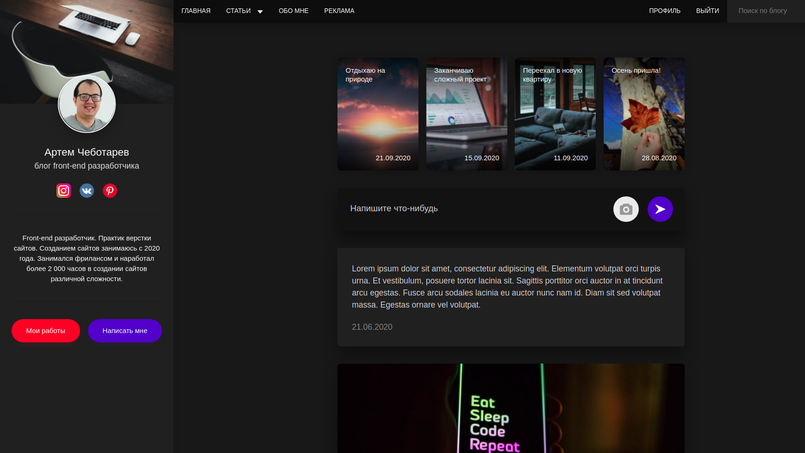

# My-Blog

## Введение
Приложение по поиску и созданию путешествий за город.

 
**Рисунок 1. Главная страница**
 

 
**Рисунок 2. Раздел Мои работы**
 

 
**Рисунок 3. Sidebar**
 

 
**Рисунок 4. Мобильная версия сайта**
 

 
**Рисунок 5. Модальное окно**
 

## Функциональность
В данном проекте я реализовал адаптивную верстку многостраничного сайта. Сборка файлов была реализована с помощью GULP.
